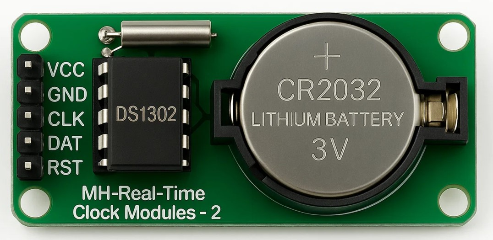

# MicroPython DS1302 RTC Driver

A pure MicroPython driver for the DS1302 real-time clock (RTC) module.

## Table of Contents

- [Overview](#overview)
- [Hardware](#hardware)
- [Pinout](#pinout)
- [Installation](#installation)
- [API Reference](#api-reference)
- [Example Usage](#example-usage)
- [Acknowledgements](#acknowledgements)

## Overview

The DS1302 is a real-time clock (RTC) integrated circuit with a simple serial interface and 31 bytes of battery-backed SRAM.  
It keeps track of second, minute, hour, day, day of the week, month, and year with leap-year compensation up to the year 2100.

This project provides a pure MicroPython driver to interface with the DS1302 module.



## Hardware

- **Chip**: DS1302
- **Voltage**: 2.0V to 5.5V
- **Battery backup**: CR2032 or similar 3V lithium cell
- **RAM**: 31 bytes battery-backed SRAM
- **Features**:
  - Serial I/O communication
  - Trickle-charge capability for backup supply
  - Timekeeping accurate up to the year 2100
  - Low power operation

## Pinout

| Pin Name | Description        |
| :------: | :----------------- |
|   VCC    | Power Supply       |
|   GND    | Ground             |
|   CLK    | Serial Clock Input |
|   DAT    | Serial Data I/O    |
|   RST    | Reset (Enable)     |

The driver requires connection to the **CLK**, **DAT**, and **RST** pins for operation.

## Installation

Copy the `ds1302.py` file into your MicroPython device's filesystem.

## API Reference

- **`DS1302(clk, dat, rst)`**

  - Initialize the DS1302 with clock, data, and reset pins.

- **`start()`**

  - Start the RTC.

- **`stop()`**

  - Stop/pause the RTC.

- **`get_date_time()` / `set_date_time(date_time)`**

  - Get or set the full date and time.
  - `get_date_time()`: Returns `[year, month, day, weekday, hour, minute, second]`.
  - `set_date_time(list)`: Sets the datetime.

- **Getters/Setters for individual components**:

  - `get_year()` / `set_year(value)`
  - `get_month()` / `set_month(value)`
  - `get_day()` / `set_day(value)`
  - `get_weekday()` / `set_weekday(value)`
  - `get_hour()` / `set_hour(value)`
  - `get_minute()` / `set_minute(value)`
  - `get_second()` / `set_second(value)`

- **RAM Access**:
  - `get_ram(register)`
  - `set_ram(register, value)`

## Example Usage

```python
from ds1302 import DS1302
from machine import Pin  # type: ignore[import]

# Initialize DS1302 RTC with the appropriate GPIO pins
rtc = DS1302(clk=Pin(0), dat=Pin(1), rst=Pin(2))

# Set the date and time: [year, month, day, weekday, hour, minute, second]
rtc.set_date_time([2025, 4, 26, 6, 14, 30, 0])  # Saturday, 14:30:00

# Alternatively, set the date and time using individual components
rtc.set_year(2084)

# Read the full date and time
print("Current date and time:", rtc.get_date_time())

# Read individual components
year = rtc.get_year()
month = rtc.get_month()
day = rtc.get_day()
weekday = rtc.get_weekday()
hour = rtc.get_hour()
minute = rtc.get_minute()
second = rtc.get_second()

print(f"Year: {year}, Month: {month}, Day: {day}, Weekday: {weekday}")
print(f"Time: {hour:02}:{minute:02}:{second:02}")

# Save a 1-byte value into RAM
rtc.set_ram(register=30, value=255)

# Read the value back from RAM register
ram_reg_30 = rtc.get_ram(register=30)
print("Value from RAM:", ram_reg_30)
```

## Acknowledgements

Thanks to previous contributors:

- https://github.com/shaoziyang
- https://github.com/omarbenhamid
